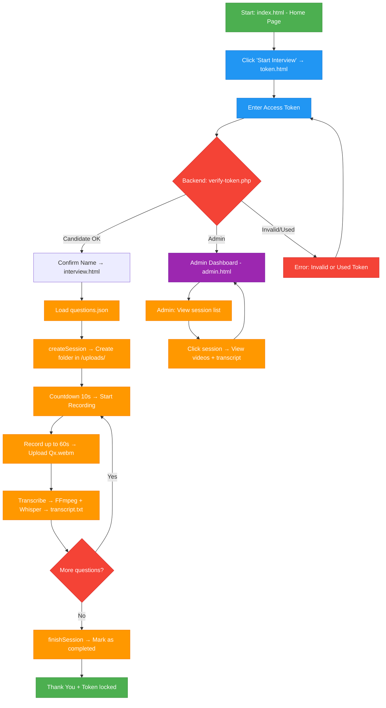

# INTERVIEW RECORDER WEBSITE
# Overview

  `interview-recorder-website` is a website used to provide interviewers with an online interview method and to store interview results.
This project aims to make the interviewing process easier. Candidates can participate in multinational interviews without needing to travel for an in-person interview. For employers, the website helps them save time and manpower during the recruitment process; in addition, the website allows employers to store the interview results of candidates.
# 1. Main Project Structure
## 1.1 Main Project Structure (From Repository)

- Root Level: index.html (homepage), token.html (token verification), interview.html (interview page), admin.html (admin dashboard), questions.json (list of questions).

- /js/: recorder-v3.js (recording logic, timer, upload), recorder.js (old version).

- /Backend/api/: PHP API files including: verify-token.php, session-start.php, upload-one.php, transcribe.php,
session-finish.php, admin-api.php, contact.php.

- /data/: tokens.json, used_tokens.json, questions.json (backup),
contact-messages.txt, interviewee.xlsx.

- /utils/: generate_tokens
## 1.2 Main Features

- Generate separate tokens for each candidate in the provided list.
- Candidates use the token to verify and participate in the interview.
- Record the candidate’s answering process for each question.
- Limit the preparation time and the answering time.
- Store the results after completion with the candidate’s name and the interview start time.
- Convert the candidate’s speech to text (Only works when the language is English).

## 1.3 Technologies Used

- Front-end: HTML / CSS / Javascript / JSON
- Back-end: PHP / FFPRESET, whisper AI
- Excel file to provide the candidate list. Python to generate tokens.

## 1.4 Overall Workflow
The project operates on a client–server model: the frontend communicates with the backend via `fetch` API calls. All data is stored lightly using JSON and text files.

### Candidate Flow
- **Step 1 — Home Page** (`index.html`)  
  Displays introduction and contact form.  
  User clicks **Start Interview** → redirects to `token.html`.

- **Step 2 — Token Verification** (`token.html`)  
  User enters token → frontend calls:  
  `POST → Backend/api/verify-token.php`  
  → Backend checks `tokens.json`:  
  • If **admin token** → redirect to `admin.html`  
  • If **candidate token** → validate one-time use via `used_tokens.json`  
    → If valid → display candidate name  
    → User confirms “That’s me” → save token & name to `sessionStorage` → go to `interview.html`

### Full Interview Flow 

1. **Load Questions**  
   **Frontend** (`interview.html` + `js/recorder-v3.js`)  
   → Reads questions directly from `questions.json` (currently 3 fixed questions).

2. **Create Session**  
   **Frontend**
      → Calls `POST Backend/api/session-start.php` with token from URL (`?t=…`)  
   **Backend** (`session-start.php`)  
   → Checks `Backend/used_tokens.json` → blocks reuse if token already exists  
   → Creates timestamped folder in `/uploads/` with exact format:  
     `DD.MM.YYYY_HH.MM_SS_CandidateName`  
   → Creates `meta.json` inside the folder (contains start time, status = "in_progress")  
   → Adds token to `used_tokens.json` → link becomes permanently one-time-use.

3. **Question Loop** (repeated exactly 3 times)  
   **Frontend**  
    - 5 seconds preparation countdown  
    - 3 seconds countdown for reading question  
    - Records video + audio using MediaRecorder (max 60 seconds)  
    - Displays live timer  
    - Auto stops and uploads when finished  
    → Calls `POST Backend/api/upload-one.php`  

   **Backend** (`upload-one.php`)  
   → Receives `token`, `question` (1–3), video file (`.webm`), and `duration`  
   → Saves video as: `Q1.webm`, `Q2.webm`, `Q3.webm` inside candidate’s folder  
   → Updates `questions` array in `meta.json`  
   → Immediately triggers transcription (see step 4).

4. **Transcription – Speech-to-Text** (auto after each upload)  
   **Backend** (`upload-one.php` → calls `transcribe.php`)  
   → **FFmpeg** (in `ffmpeg/` folder):  
        Extracts audio from the latest `.webm` → creates temporary `temp.wav`  
   → **Whisper.cpp** (in `whisper/` folder + `ggml-base.en.bin` model):  
        Runs local AI speech recognition → appends recognized text to `transcript.txt`  
        (adds header like "Question 1:", "Question 2:", etc.)  
   → Final result: one single `transcript.txt` containing all 3 answers in order  
   → Deletes `temp.wav` right after processing.

5. **Finish Session**  
   **Frontend** → After last question, calls `POST Backend/api/session-finish.php`  
   **Backend** (`session-finish.php`)  
   → Opens `meta.json` → sets `status = "completed"` and writes `completed_at` timestamp.

6. **Thank You Screen + Final Storage**  
   **Frontend** → Shows "Thank you" message and disables the link.  
   **Backend** → Interview is now fully saved and ready for review.  

   **Final folder structure (exactly what you see in real uploads):**
``` text
uploads/
└── DD.MM.YYYY_HH.MM_SS_CandidateName/
├── meta.json          ← metadata, timestamps, status
├── Q1.webm            ← Answer 1 video
├── Q2.webm            ← Answer 2 video
├── Q3.webm            ← Answer 3 video
└── transcript.txt     ← Full auto transcript of all answers
```
### Admin Review Flow 

1. **Access Results**  
   Open the `/uploads/` folder directly on the server (via file manager, FTP, or shared drive).

2. **List All Submissions**  
   Each completed interview is a clearly named, timestamped folder:
``` text
uploads/
├── 10.12.2025_23.51_Nguyen_Van_A/
├── 11.12.2025_00.01_Pham_Thi_B/
└── ...
```
3. **View Any Submission**  
``` text
Open the candidate’s folder → all files ready instantly:
├── meta.json          
├── Q1.webm           
├── Q2.webm      
├── Q3.webm           
└── transcript.txt     
```
4. **Play Videos**  
Double-click any `.webm` file → plays immediately in browser or any video player.

5. **Read Transcript**  
Open `transcript.txt` → read everything the candidate said, perfectly formatted.

### Support & Utility Features 

1. **One-Time Token Rule**  
Every link works exactly once.  
As soon as the candidate starts → token is added to `Backend/used_tokens.json` → reuse is blocked forever.

2. **Generate Tokens Anytime**  
Run the included script:
```bash
python utils/generate_tokens.py
```
# 2. SYSTEM FEATURES (FULL DETAILS)

## 2.1 Video Recording Engine

- Uses MediaRecorder API    
- Live camera preview  
- Automatically stops when countdown = 0  
- Saves video as blob, then uploads via Fetch  
- Re-encoding compatibility with ffmpeg (server-side)  

## 2.2 Time Control System

Each question has:  
- **Answer time:** 60s
- **Break time after question:**  5s  
- **One break for preparation:** 3s
During breaks, it can display:  
- “Start Recording”  
Countdown includes:  
- Timer display mm:ss  
- Progress bar  

## 2.3 Token Authentication

- Each candidate has a unique token  
- Token check for existence
- If invalid → return "Token invalid"

## 2.4 Upload & Storage Module

Upload workflow:  
1. MediaRecorder → Blob  
2. Blob → FormData  
3. Fetch POST → `/api/upload-video`  
4. Backend saves file: `/records/<token>/<question>.webm`  
5. (Optional) ffmpeg remux → mp4  
6. Send webhook/email when all videos are completed  

Upload includes:  
- Maximum size 100MB/video  
- SHA-256 hash checksum  

## 2.5 UI/UX

- Mobile-first  
- Bootstrap 5  
- 2 main buttons:  
  - Start Recording  
  - Stop Recording  

- Question screen:  
  - Title  
  - Description  
  - Countdown  
  - Camera preview  
- Break screen:  
  - Remaining time  
  - Next question 
  - Skip button

# 3. SYSTEM ARCHITECTURE
```text
┌───────────────────┐
│      Browser       │
│  (Frontend + JS)   │
└───────┬───────────┘
        │  MediaRecorder → upload video chunks
        ▼
┌───────────────────┐
│     Upload API     │
│   (/api/upload)    │
└───────┬───────────┘
        │  Save files
        ▼
┌───────────────────┐
│    File Storage    │
│   (/uploads/)      │
└───────┬───────────┘
        │  Notify HR
        ▼
┌───────────────────┐
│  Webhook / Email   │
└───────────────────┘
```
# 4. Project structure
``` text
interview-recorder-website/
├── Backend/
│   ├── api/
│   │   ├── admin-api.php
│   │   ├── contact.php
│   │   ├── session-finish.php
│   │   ├── session-start.php
│   │   ├── transcribe.php
│   │   ├── upload-one.php
│   │   └── verify-token.php
│   ├── ffmpeg/
│   └── whisper/
│
├── assets/
│   └── css/
│       └── style.css
│
├── data/
│   ├── contact-messages.txt
│   ├── interviewee.xlsx
│   ├── questions.json
│   └── tokens.json
│
├── frontend/
│   ├── js/
│   │   ├── recorder.js
│   │   └── recorder-v3.js
│   ├── admin.html
│   ├── index.html
│   ├── interview.html
│   ├── token.html
│   ├── icon.png
│   └── icon1.png
│
├── utils/
│   ├── generate_tokens.py
│   └── RUN.bat
│
└── README.md        


```
# 5. INSTALLATION & DEPLOYMENT
## 5.1 Clone project
``` bash
git clone https://github.com/nhnminh1409/interview-recorder-website
cd interview-recorder-website
pip install pandas
```
## 5.2 Local Setup (XAMPP – Recommended)

This project is designed to run using a local web server via **XAMPP Apache**.

### Steps:
``` sql
1. Install and open **XAMPP Control Panel**  
2. Start the **Apache** service  
3. Copy the entire project folder
4. Get the computer’s local IP address (the machine running XAMPP).
```

You will use this IP to access the interview page from any device on the same network.

---

## 5.3 Token Generator (Python)

Tokens are generated automatically using the **RUN** script.

Run:

```bash
/utils/RUN.bat
```
List of generated tokens can be found in /Candidates.../interviewee_tokens.csv or /data/tokens.json.

## 5.4. How candidates access the system
After tokens are generated and Apache is running, candidates access the interview by opening:
```perl
http://<your-local-ip>/interview-recorder-website
```
## 5.5. Check used_tokens.
```perl
/data/used_tokens.json
```

# 6. API DOCUMENTATION (FULL)
## 6.1 Check token
POST /api/check-token
Request:
``` json
 "token": "abc123" 
```

Response:
``` json

  "valid": true,
  "candidate": "Nguyen Van A",
 

```
## 6.2 Upload video
POST /api/upload-video

FormData:
``` makefile
token: abc123
question: 1
file: <blob>
```

Response:
``` json

"status": "success",
"video_path": "/records/abc123/1.webm"

```
## 6.3 Mark interview complete

POST /api/complete

Response:
``` json
"status": "ok" 
```

## 7. INTERVIEW FLOW DIAGRAM 

- Note:

  - Green: Start & End

  - Blue: User actions (token input)

  - Orange: Processing steps (recording, upload, transcribe…)

  - Gray: Decision points & loops 

  - Deep purple: Admin area

  - Red: Error state
