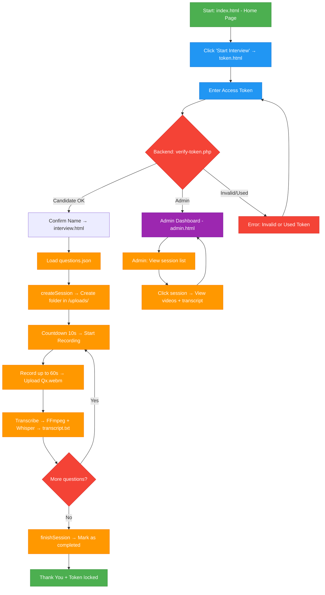

# INTERVIEW RECORDER WEBSITE
# Overview

  `interview-recorder-website` is a website used to provide interviewers with an online interview method and to store interview results.
This project aims to make the interviewing process easier. Candidates can participate in multinational interviews without needing to travel for an in-person interview. For employers, the website helps them save time and manpower during the recruitment process; in addition, the website allows employers to store the interview results of candidates.
# 1. Main Project Structure
## 1.1 Main Project Structure (From Repository)

- Root Level: index.html (homepage), token.html (token verification), interview.html (interview page), admin.html (admin dashboard), questions.json (list of questions).

- /js/: recorder-v3.js (recording logic, timer, upload), recorder.js (old version).

- /Backend/api/: PHP API files including: verify-token.php, session-start.php, upload-one.php, transcribe.php,
session-finish.php, admin-api.php, contact.php.

- /data/: tokens.json, used_tokens.json, questions.json (backup),
contact-messages.txt, interviewee.xlsx.

- /utils/: generate_tokens
## 1.2 Main Features

- Generate separate tokens for each candidate in the provided list.
- Candidates use the token to verify and participate in the interview.
- Record the candidate’s answering process for each question.
- Limit the preparation time and the answering time.
- Store the results after completion with the candidate’s name and the interview start time.
- Convert the candidate’s speech to text (Only works when the language is English).

## 1.3 Technologies Used

### 1.3.1. Front-end: 
- HTML: Core markup for pages like `index.html` (home), `token.html` (auth), `interview.html` (recording UI), and `admin.html` (dashboard).
- CSS: Styling and responsive layout via `style.css` in `/assets/css/`. Bootstrap handles grid, components (e.g., buttons, modals).
- Javascript: Dynamic behavior: `recorder-v3.js` manages timers (10s countdown), MediaRecorder API for webcam/mic capture, Fetch API for uploads, and session storage. Legacy: `recorder.js`
- JSON: Data interchange: `questions.json` for interview prompts; parsed via `fetch()`.
- MediaRecorder API: Browser-native API for recording video/audio streams as WebM blobs during interviews.
### 1.3.2. Back-end
- PHP: Core backend language for API endpoints (e.g., `verify-token.php` for auth, `upload-one.php` for file handling, `transcribe.php` for AI pipeline). Manages token validation, session folders in `/uploads/`, and JSON file I/O.
#### Processing and Media Handling
- FFPRESET: Command-line tool invoked via PHP `shell_exec()` to extract audio (MP3) from uploaded WebM videos (e.g., -i Q1.webm -vn -ar 16000 -ac 1 audio.mp3).
- Whisper AI: OpenAI's speech-to-text model for transcribing extracted audio to `transcript.txt` (English-only; e.g., `whisper audio.mp3 --model base --output_format txt`)
### 1.3.3. Utilities and Data Management
- Python: Utility scripting: `generate_tokens.py` reads `interviewee.xlsx`, generates random alphanumeric tokens (32 chars), and populates `tokens.json`.
- Pandas: Data manipulation in Python: Parses Excel files and exports JSON/CSV for tokens.
- Excel(xlsx): Input format for candidate lists (`interviewee.xlsx` columns: Name, Email).
  
## 1.4 Overall Workflow
This section provides a complete, end-to-end overview of how the system operates, covering token generation, candidate experience, recording process, backend processing, and admin review.

### 1. Token Generation (Preparation Phase – Admin/HR)
Token Generation: Offline (Python) → JSON update.
1. HR prepares a list of candidates in data/interviewee.xlsx (columns: Name, Email).
2. Run the utility script:
   ```bash
   python utils/generate_tokens.py (or via RUN.bat).
   ```
3. The script:
- Reads the Excel file using Pandas.
- Generates unique 32-character alphanumeric tokens.
- Assigns expiration (default configurable).
- Writes all valid tokens to `data/tokens.json`.
4. Tokens are distributed to candidates via email or secure channel.
   
### Interview Flow (`interview.html` + `js/recorder-v3.js`)
Candidate Flow: Browser → Token verify (PHP) → Session start (folder create) → Record/Upload loop (blob → PHP save → FFmpeg/Whisper) → Finish (update JSON).
#### 1. Access the Site
- Candidate opens `index.html` (home page).
- Clicks "Start Interview" → redirected to `token.html`.

#### 2. Token Authentication
- Candidate enters the one-time token.
- Frontend POSTs to `Backend/api/verify-token.php`.
- Backend checks:
  - Token exists in `tokens.json`.
  - Token not in `used_tokens.json`.
  - IP-based rate limiting (max 5 failed attempts → 15-minute block).  
- On success: Stores token in `sessionStorage`, displays candidate name, proceeds to `interview.html`.
- On failure: Shows error (invalid/used/expired).

#### 3. Interview Session Start
- `session-start.php` creates a dedicated folder `uploads/<token>/`.
- Loads questions from `data/questions.json` (array of question objects).
- Initializes `meta.json` for tracking progress.

#### 4. Question Loop (Per Question)
- Display current question text.
- 10-second countdown (preparation timer).
- Automatically start recording:
  - Uses browser MediaRecorder API (webcam + microphone).
  - Records for maximum 60 seconds (stops early if candidate clicks "Stop").
  - Output: WebM format blob.


- After recording:
  - Upload blob to upload-one.php → saved as Q1.webm, Q2.webm, etc., in session folder.
  - Backend triggers transcribe.php:
    - FFmpeg extracts audio → audio.mp3.
    - Whisper (local model) transcribes → appends to transcript.txt.
  - Update `meta.json` with duration, timestamp.

#### 5. Completion
- After last question:
  - Call `session-finish.php`.
  - Marks token as used (adds to `used_tokens.json`).
  - Displays "Thank You" page.
  - Token is now permanently locked.

### Admin Review Flow 
Admin Flow: Browser → API list (scan folders) → View (fetch files/metadata).
1. **Access Results**  
   Open the `/uploads/` folder directly on the server (via file manager, FTP, or shared drive).
2. **List All Submissions**  
   Each completed interview is a clearly named, timestamped folder:
``` text
uploads/
├── 10.12.2025_23.51_Nguyen_Van_A/
├── 11.12.2025_00.01_Pham_Thi_B/
└── ...
```
3. **View Any Submission** 
``` text
Open the candidate’s folder → all files ready instantly:
├── meta.json          
├── Q1.webm           
├── Q2.webm      
├── Q3.webm           
└── transcript.txt     
```
4. **Play Videos**  
Double-click any `.webm` file → plays immediately in browser or any video player.
5. **Read Transcript**  
Open `transcript.txt` → read everything the candidate said, perfectly formatted.
6. **Reply any feedback or messages**
### Support & Utility Features 

1. **One-Time Token Rule**  
Every link works exactly once.  
As soon as the candidate starts → token is added to `Backend/used_tokens.json` → reuse is blocked forever.

2. **Generate Tokens Anytime**  
Run the included script:
```bash
python utils/generate_tokens.py
```
# 2. SYSTEM FEATURES (FULL DETAILS)

## 2.1 Video Recording Engine

- Uses MediaRecorder API    
- Live camera preview  
- Automatically stops when countdown = 0  
- Saves video as blob, then uploads via Fetch  
- Re-encoding compatibility with ffmpeg (server-side)  

## 2.2 Time Control System

Each question has:  
- **Answer time:** 60s
- **Break time after question:**  5s  
- **One break for preparation:** 3s
During breaks, it can display “Start Recording” to start before finish countdown.
Countdown includes:  
- Timer display mm:ss  

## 2.3 Token Authentication

- Each candidate has a unique token  
- Token check for existence
- If invalid → return "Token invalid"

## 2.4 Upload & Storage Module

Upload workflow:  
1. MediaRecorder → Blob  
2. Blob → FormData  
3. Fetch POST → `/api/upload-video`  
4. Backend saves file: `/uploads/<token>/Q<question_number>.webm`    

Upload includes:  
- Maximum size 100MB/video  
- SHA-256 hash checksum  

## 2.5 UI/UX

- Mobile-first  
- Bootstrap 5  
- 2 main buttons:  
  - Start Recording  
  - Stop Recording  

- Question screen:  
  - Title    
  - Countdown
  - Break time  
  - Camera preview  

# 3. SYSTEM ARCHITECTURE
## 3.1. Key Components and Modules
### 3.1.1. Frontend Components
- Directories/Files:`/frontend/` (HTML pages), `/assets/css/` (styles), `/frontend/js/` (scripts like `recorder-v3.js`).
- Core Functionality: Handles token entry, question display, countdown timers (5s break, 3s prep, 60s record), video capture via MediaRecorder API, and uploads. Includes anti-cheat (tab detection, face-api.js for occupancy check).
- Data Flow: Fetches JSON (questions/tokens), posts blobs to APIs; uses `sessionStorage` for transient state.
### 3.1.2. Backend Components
- Directories/Files:`/Backend/api/` (PHP endpoints: `verify-token.php`, `session-start.php`, `upload-one.php`, `transcribe.php`, `session-finish.php`, `admin-api.php`, `contact.php`).
- Core Functionality: Token validation (against JSON), session folder creation (`/uploads/<token>/`), video saving (with 100MB limit and SHA-256 checksum), transcription pipeline, and admin queries (folder scanning).
- Processing: Synchronous; uses `shell_exec()` for FFmpeg (audio extraction) and Whisper (STT to `transcript.txt`).
- Dependencies: FFmpeg and Whisper must be installed locally (paths in `/Backend/ffmpeg/` and `/Backend/whisper/` implied).
### 3.1.3. Storage and Data Management
- Approach: File-centric, no RDBMS. Sessions in `/uploads/<token>/` (e.g., `Q1.webm`, `meta.json`, `transcript.txt`). Global data in `/data/` (e.g., `tokens.json`, `used_tokens.json`, `questions.json`, `contact-messages.txt`).
- Proposed Enhancement: README includes PostgreSQL schema for tokens, interview_results, and logs tables—indicating a path to relational storage for better querying.
### 3.1.4. Utilities
- Directories/Files:/utils/ (`generate_tokens.py`, `RUN.bat`).
- Functionality: Offline Python script using Pandas to generate tokens from `interviewee.xlsx` and update JSON. Not part of runtime architecture.
## 3.2. Architechture diagram.
```text
┌───────────────────────────────────────────┐
│        Browser/Client                     │
│ (HTML/CSS/JS + MediaRecorder)             │
│ - UI: index/token/interview/admin.html    │
│ - Logic: recorder-v3.js (Timers, Uploads) │
└──────────────┬────────────────────────────┘
               │ HTTP/Fetch (POST/GET)
               ▼
┌───────────────────────────────────────────┐
│       Apache + PHP Backend                │
│ - APIs: verify-token.php, upload-one.php, │
│   transcribe.php, admin-api.php, etc.     │
│ - Processing: shell_exec(FFmpeg + Whisper)│
└──────────────┬────────────────────────────┘
               │ File I/O
               ▼
┌───────────────────────────────────────────┐
│       File Storage                        │
│ - /uploads/<token>/ (Videos, Transcripts) │
│ - /data/ (tokens.json, questions.json)    │
└──────────────┬────────────────────────────┘
               │ Optional (Python Utility)
               ▼
┌──────────────────────────────────────────────┐
│      Utilities (Offline)                     │
│ - generate_tokens.py (Pandas for Excel/JSON) │
└──────────────────────────────────────────────┘
```
# 4. Project structure
``` text
interview-recorder-website/
├── Backend/
│   ├── api/
│   │   ├── admin-api.php
│   │   ├── contact.php
│   │   ├── session-finish.php
│   │   ├── session-start.php
│   │   ├── transcribe.php
│   │   ├── upload-one.php
│   │   └── verify-token.php
│   ├── ffmpeg/
│   └── whisper/
│
├── assets/
│   └── css/
│       └── style.css
│
├── data/
│   ├── contact-messages.txt
│   ├── interviewee.xlsx
│   ├── questions.json
│   └── tokens.json                 #(auto create by running generate_tokens.py)
│
├── frontend/
│   ├── js/
│   │   ├── recorder.js
│   │   └── recorder-v3.js
│   ├── admin.html
│   ├── index.html
│   ├── interview.html
│   ├── token.html
│   ├── icon.png
│   └── icon1.png
│
├── utils/
│   ├── Candidates_YYYY-MM-DD/
│       ├── interviewee_tokens.csv  #(Excal file with names and tokens)
│       └── tokens_backup.json
│   ├── generate_tokens.py          #(generate tokens for candidates)
│   └── RUN.bat                     #(quick run generate_tokens.py)
│
└── uploads/                        #(Store interview videos)        
```
## 5. INTERVIEW FLOW DIAGRAM 

- Note:

  - Green: Start & End

  - Blue: User actions (token input)

  - Orange: Processing steps (recording, upload, transcribe…)

  - Gray: Decision points & loops 

  - Deep purple: Admin area

  - Red: Error state
# 6. INSTALLATION & DEPLOYMENT
## 6.1 Clone project
``` bash
pip install pandas openpyxl

git clone https://github.com/nhnminh1409/interview-recorder-website
cd interview-recorder-website
```
## 6.2 Local Setup (XAMPP – Recommended)

This project is designed to run using a local web server via **XAMPP Apache**.

### Steps:
``` sql
1. Install and open **XAMPP Control Panel**  
2. Start the **Apache** service  
3. Copy the entire project folder to htdocs/.
4. Get the computer’s local IP address (the machine running XAMPP).
```

You will use this IP to access the interview page from any device on the same network.

---

## 6.3 Token Generator (Python)
Tokens are generated automatically using the **RUN** script.
Run:
```bash
py utils/generate_tokens.py
```
or
```bash
python utils/generate_tokens.py
```
or
```perl
/utils/RUN.bat #Easiest way
```
List of generated tokens can be found in /Candidates.../interviewee_tokens.csv or /data/tokens.json.

## 6.4. How candidates access the system
After tokens are generated and Apache is running, candidates access the interview by opening:
```perl
http://<your-local-ip>/interview-recorder-website/frontend
```
## 6.5. Check used_tokens.
```perl
/data/used_tokens.json
```
# 7. API DOCUMENTATION (FULL)
## 7.1 Check token
POST /api/check-token
Request:
``` json
 "token": "abc123" 
```

Response:
``` json
  "valid": true,
  "candidate": "Nguyen Van A",
 
```
## 7.2 Upload video
POST /api/upload-video

FormData:
``` makefile
token: abc123
question: 1
file: <blob>
```

Response:
``` json
"status": "success",
"video_path": "/records/abc123/1.webm"
```
## 7.3 Mark interview complete

POST /api/complete

Response:
``` json
"status": "ok" 
```
