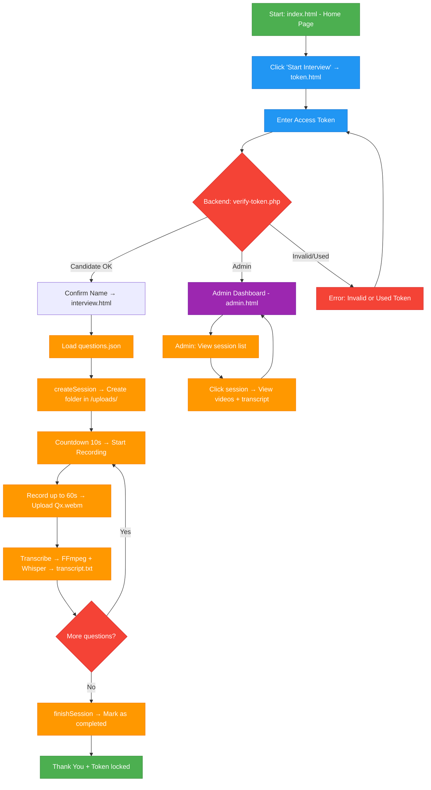

# INTERVIEW RECORDER WEBSITE
# Overview

  `interview-recorder-website` is a website used to provide interviewers with an online interview method and to store interview results.
This project aims to make the interviewing process easier. Candidates can participate in multinational interviews without needing to travel for an in-person interview. For employers, the website helps them save time and manpower during the recruitment process; in addition, the website allows employers to store the interview results of candidates.
# 1. Main Project Structure
## 1.1 Main Project Structure (From Repository)

- Root Level: index.html (homepage), token.html (token verification), interview.html (interview page), admin.html (admin dashboard), questions.json (list of questions).

- /js/: recorder-v3.js (recording logic, timer, upload), recorder.js (old version).

- /Backend/api/: PHP API files including: verify-token.php, session-start.php, upload-one.php, transcribe.php,
session-finish.php, admin-api.php, contact.php.

- /data/: tokens.json, used_tokens.json, questions.json (backup),
contact-messages.txt, interviewee.xlsx.

- /utils/: generate_tokens
## 1.2 Main Features

- Generate separate tokens for each candidate in the provided list.
- Candidates use the token to verify and participate in the interview.
- Record the candidate’s answering process for each question.
- Limit the preparation time and the answering time.
- Store the results after completion with the candidate’s name and the interview start time.
- Convert the candidate’s speech to text (Only works when the language is English).

## 1.3 Technologies Used

### 1.3.1. Front-end: 
- HTML: Core markup for pages like `index.html` (home), `token.html` (auth), `interview.html` (recording UI), and `admin.html` (dashboard).
- CSS: Styling and responsive layout via `style.css` in `/assets/css/`. Bootstrap handles grid, components (e.g., buttons, modals).
- Javascript: Dynamic behavior: `recorder-v3.js` manages timers (10s countdown), MediaRecorder API for webcam/mic capture, Fetch API for uploads, and session storage. Legacy: `recorder.js`
- JSON: Data interchange: `questions.json` for interview prompts; parsed via `fetch()`.
- MediaRecorder API: Browser-native API for recording video/audio streams as WebM blobs during interviews.
### 1.3.2. Back-end
- PHP: Core backend language for API endpoints (e.g., `verify-token.php` for auth, `upload-one.php` for file handling, `transcribe.php` for AI pipeline). Manages token validation, session folders in `/uploads/`, and JSON file I/O.
### 1.3.3. Processing and Media Handling
- FFPRESET: Command-line tool invoked via PHP `shell_exec()` to extract audio (MP3) from uploaded WebM videos (e.g., -i Q1.webm -vn -ar 16000 -ac 1 audio.mp3).
- Whisper AI: OpenAI's speech-to-text model for transcribing extracted audio to `transcript.txt` (English-only; e.g., `whisper audio.mp3 --model base --output_format txt`)
### 1.3.4. Utilities and Data Management
- Python: Utility scripting: `generate_tokens.py` reads `interviewee.xlsx`, generates random alphanumeric tokens (32 chars), and populates `tokens.json`.
- Pandas: Data manipulation in Python: Parses Excel files and exports JSON/CSV for tokens.
- Excel(xlsx): Input format for candidate lists (`interviewee.xlsx` columns: Name, Email).
  
## 1.4 Overall Workflow
This section provides a complete, end-to-end overview of how the system operates, covering token generation, candidate experience, recording process, backend processing, and admin review.

### 1. Token Generation (Preparation Phase – Admin/HR)

1. HR prepares a list of candidates in data/interviewee.xlsx (columns: Name, Email).
2. Run the utility script:
   ```bash
   python utils/generate_tokens.py (or via RUN.bat).
   ```
3. The script:
- Reads the Excel file using Pandas.
- Generates unique 32-character alphanumeric tokens.
- Assigns expiration (default configurable).
- Writes all valid tokens to `data/tokens.json`.
4. Tokens are distributed to candidates via email or secure channel.
   
### Interview Flow (`interview.html` + `js/recorder-v3.js`)
1. **Load Questions**  
   Fetched directly from `questions.json`.

2. **Create Session**  
   Call `Backend/api/session-start.php` → backend creates a new folder under `/uploads/` with `meta.json`.

3. **Question Loop** (repeated for all 5 questions)
   - 5 seconds preparation countdown 
   - 3 seconds countdown for reading question 
   - Recording using MediaRecorder (video + audio, max 60 seconds)  
   - Live timer displayed  
   - Auto upload after stop → `Backend/api/upload-one.php` saves as `Q1.webm`, `Q2.webm`, …  
   - Update `meta.json`  
   - Transcription: `transcribe.php` → FFmpeg extracts audio → Whisper → saves to `transcript.txt`

5. **Finish Session**  
   Call `Backend/api/session-finish.php` → update `meta.json` status = `completed`.

6. **Thank You Screen**  
   Token is permanently marked as used in `used_tokens.json`.
2. Candidate Interview Process

### 1. Access the Site
- Candidate opens `index.html` (home page).
- Clicks "Start Interview" → redirected to `token.html`.

### 2. Token Authentication
- Candidate enters the one-time token.
- Frontend POSTs to `Backend/api/verify-token.php`.
- Backend checks:
  - Token exists in `tokens.json`.
  - Token not in `used_tokens.json`.
  - IP-based rate limiting (max 5 failed attempts → 15-minute block).  
- On success: Stores token in `sessionStorage`, displays candidate name, proceeds to `interview.html`.
- On failure: Shows error (invalid/used/expired).

### 3. Interview Session Start
session-start.php creates a dedicated folder: uploads/<token>/.
Loads questions from data/questions.json (array of question objects).
Initializes meta.json for tracking progress.

### 4. Question Loop (Per Question)
Display current question text.
10-second countdown (preparation timer).
Automatically start recording:
Uses browser MediaRecorder API (webcam + microphone).
Records for maximum 60 seconds (stops early if candidate clicks "Stop").
Output: WebM format blob.


After recording:
Upload blob to upload-one.php → saved as Q1.webm, Q2.webm, etc., in session folder.
Backend triggers transcribe.php:
FFmpeg extracts audio → audio.mp3.
Whisper (local model) transcribes → appends to transcript.txt.
Update meta.json with duration, timestamp.

### 5. Completion
After last question:
Call session-finish.php.
Marks token as used (adds to used_tokens.json).
Displays "Thank You" page.
Token is now permanently locked.
### Admin Flow (`admin.html`)
Accessed only via admin token.

**Main Features:**
- List all sessions → `admin-api.php?action=list`  
  (reads all folders in `/uploads/` and their `meta.json`)
- View detailed session → `admin-api.php?action=view&folder=...`  
  Displays: videos (Q1–Q5), transcript, metadata
- Dashboard auto-refreshes every 5 seconds
- Modal video player for preview

### Support Flows
- **Generate Tokens**  
  Run: `utils/generate_tokens.py`  
  Reads `interviewee.xlsx` → auto-generates tokens → updates `tokens.json` & creates backup.

- **Contact Form**  
  `index.html` → `Backend/api/contact.php` → appends message to `data/contact-messages.txt`.

- **One-Time Token Rule**  
  After a candidate starts the interview, their token is added to `used_tokens.json`.  
  Admin tokens are exempt from this rule.
# 2. SYSTEM FEATURES (FULL DETAILS)

## 2.1 Video Recording Engine

- Uses MediaRecorder API    
- Live camera preview  
- Automatically stops when countdown = 0  
- Saves video as blob, then uploads via Fetch  
- Re-encoding compatibility with ffmpeg (server-side)  

## 2.2 Time Control System

Each question has:  
- **Answer time:** 60s
- **Break time after question:**  5s  
- **One break for preparation:** 3s
During breaks, it can display:  
- “Start Recording”  
Countdown includes:  
- Timer display mm:ss  
- Progress bar  

## 2.3 Token Authentication

- Each candidate has a unique token  
- Token check for existence
- If invalid → return "Token invalid"

## 2.4 Upload & Storage Module

Upload workflow:  
1. MediaRecorder → Blob  
2. Blob → FormData  
3. Fetch POST → `/api/upload-video`  
4. Backend saves file: `/records/<token>/<question>.webm`  
5. (Optional) ffmpeg remux → mp4  
6. Send webhook/email when all videos are completed  

Upload includes:  
- Maximum size 100MB/video  
- SHA-256 hash checksum  

## 2.5 UI/UX

- Mobile-first  
- Bootstrap 5  
- 2 main buttons:  
  - Start Recording  
  - Stop Recording  

- Question screen:  
  - Title  
  - Description  
  - Countdown  
  - Camera preview  
- Break screen:  
  - Remaining time  
  - Next question 
  - Skip button

## 2.6 Security & Basic Anti-Cheating (Tier 2+)
- Token can be used only once → after session-start, mark used: true
- If same token were used, return "Token used! Please contact to admin for support."
- Each IP can enter a wrong token only 5 times → block for 15 minutes
- Disable right-click, Ctrl+C, Ctrl+V on the interview page
- Detect tab switching → pause recording + show warning
- Video must have a face occupying >40% of the frame (simple detection using face-api.js – bonus feature)

# 3. SYSTEM ARCHITECTURE
```text
┌───────────────────┐
│      Browser       │
│  (Frontend + JS)   │
└───────┬───────────┘
        │  MediaRecorder → upload video chunks
        ▼
┌───────────────────┐
│     Upload API     │
│   (/api/upload)    │
└───────┬───────────┘
        │  Save files
        ▼
┌───────────────────┐
│    File Storage    │
│   (/uploads/)      │
└───────┬───────────┘
        │  Notify HR
        ▼
┌───────────────────┐
│  Webhook / Email   │
└───────────────────┘
```
# 4. Project structure
``` text
interview-recorder-website/
├── Backend/
│   ├── api/
│   │   ├── admin-api.php
│   │   ├── contact.php
│   │   ├── session-finish.php
│   │   ├── session-start.php
│   │   ├── transcribe.php
│   │   ├── upload-one.php
│   │   └── verify-token.php
│   ├── ffmpeg/
│   └── whisper/
│
├── assets/
│   └── css/
│       └── style.css
│
├── data/
│   ├── contact-messages.txt
│   ├── interviewee.xlsx
│   ├── questions.json
│   └── tokens.json
│
├── frontend/
│   ├── js/
│   │   ├── recorder.js
│   │   └── recorder-v3.js
│   ├── admin.html
│   ├── index.html
│   ├── interview.html
│   ├── token.html
│   ├── icon.png
│   └── icon1.png
│
├── utils/
│   ├── generate_tokens.py
│   └── RUN.bat
│
└── README.md        


```
# 5. INSTALLATION & DEPLOYMENT
## 5.1 Clone project
``` bash
git clone https://github.com/nhnminh1409/interview-recorder-website
cd interview-recorder-website
pip install pandas
```
## 5.2 Local Setup (XAMPP – Recommended)

This project is designed to run using a local web server via **XAMPP Apache**.

### Steps:
``` sql
1. Install and open **XAMPP Control Panel**  
2. Start the **Apache** service  
3. Copy the entire project folder
4. Get the computer’s local IP address (the machine running XAMPP).
```

You will use this IP to access the interview page from any device on the same network.

---

## 5.3 Token Generator (Python)

Tokens are generated automatically using the **RUN** script.

Run:

```bash
/utils/RUN.bat
```
List of generated tokens can be found in /Candidates.../interviewee_tokens.csv or /data/tokens.json.

## 5.4. How candidates access the system
After tokens are generated and Apache is running, candidates access the interview by opening:
```perl
http://<your-local-ip>/interview-recorder-website
```
## 5.5. Check used_tokens.
```perl
/data/used_tokens.json
```

# 6. DATABASE SCHEMA
``` sql
CREATE TABLE tokens (
    id SERIAL PRIMARY KEY,
    token VARCHAR(64) UNIQUE NOT NULL,
    candidate_name VARCHAR(255),
    email VARCHAR(255),
    expires_at TIMESTAMP,
    used BOOLEAN DEFAULT FALSE,
    created_at TIMESTAMP DEFAULT NOW()
);

CREATE TABLE interview_results (
    id SERIAL PRIMARY KEY,
    token VARCHAR(64) REFERENCES tokens(token),
    question_number INTEGER NOT NULL,
    video_path TEXT NOT NULL,
    duration INTEGER,
    filesize BIGINT,
    created_at TIMESTAMP DEFAULT NOW()
);

CREATE TABLE logs (
    id SERIAL PRIMARY KEY,
    token VARCHAR(64),
    event TEXT,
    metadata JSON,
    created_at TIMESTAMP DEFAULT NOW()
);
```

# 7. API DOCUMENTATION (FULL)
## 7.1 Check token
POST /api/check-token
Request:
``` json
 "token": "abc123" 
```

Response:
``` json

  "valid": true,
  "candidate": "Nguyen Van A",
 

```
## 7.2 Upload video
POST /api/upload-video

FormData:
``` makefile
token: abc123
question: 1
file: <blob>
```

Response:
``` json

"status": "success",
"video_path": "/records/abc123/1.webm"

```
## 7.3 Mark interview complete

POST /api/complete

Response:
``` json
"status": "ok" 
```

## 8. INTERVIEW FLOW DIAGRAM (ASCII)

- Note:

  - Green: Start & End

  - Blue: User actions (token input)

  - Orange: Processing steps (recording, upload, transcribe…)

  - Gray: Decision points & loops 

  - Deep purple: Admin area

  - Red: Error state
